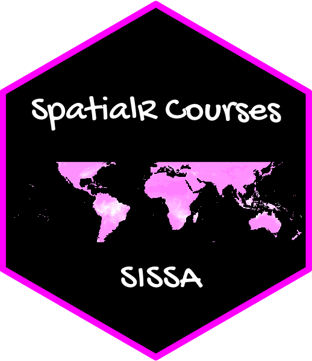

# rSISSA 

> Este paquete contiene las diapositivas y ejercicios utilizados en el Taller de fusión de datos satelitales con estaciones - SISSA:

- 1.  Introducción al curso

- 2.  Introducción a R - Parte 1

- 3.  Introducción a R - Parte 2

- 4.  Rásters y datos espaciales

- 5.  Procesamiento de datos

- 6.  Estadísticas espaciales y temporales


### Instalación y uso

Asegúrese de que el paquete **remotes** esté instalado:
```r
install.packages("remotes")
```
Instale el paquete **rSISSA** desde GitHub:
```r
remotes::install_github("obaezvil/rSISSA")
```
Cargue el paquete:
```r
library(rSISSA)
```
Abra el primer módulo:
```r
render_lectures("Intro") 
```

En caso de que la descarga falle con el siguiente error: **Error in utils::download.file**, puede intentar aumentar el tiempo de espera para las descargas de la siguiente manera y volver a intentarlo.
```r
options(timeout=500) 
remotes::install_github("obaezvil/rSISSA")
```

El enlace a los datos es el siguiente:
[https://th-koeln.sciebo.de/s/67HCqQCdH907Wgp](https://th-koeln.sciebo.de/s/Yq1r35VB0z5sZuc)